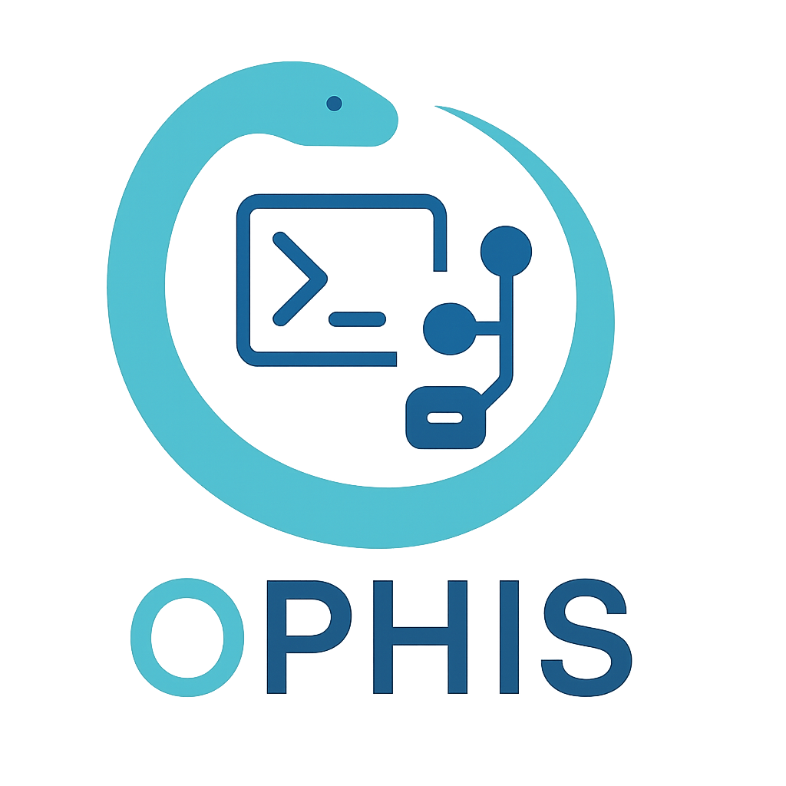

**Transform any Cobra CLI into an MCP server**

Ophis automatically converts your Cobra commands into MCP tools, and provides CLI commands for integration with Claude Desktop, VSCode, and Cursor.

## Quick Start

### Install

```bash
go get github.com/onexstack/cobrax
```

### Add to your CLI

```go
package main

import (
    "os"
    "github.com/onexstack/cobrax"
)

func main() {
    rootCmd := createMyRootCommand()
    rootCmd.AddCommand(cobrax.Command(nil))

    if err := rootCmd.Execute(); err != nil {
        os.Exit(1)
    }
}
```

### Enable in Claude Desktop, VSCode, or Cursor

```bash
# Claude Desktop
./my-cli mcp claude enable
# Restart Claude Desktop

# VSCode (requires Copilot in Agent Mode)
./my-cli mcp vscode enable

# Cursor
./my-cli mcp cursor enable
```

Your CLI commands are now available as MCP tools!

### Stream over HTTP

Expose your MCP server over HTTP for remote access:

```bash
./my-cli mcp stream --host localhost --port 8080
```

## Commands

The `cobrax.Command(nil)` adds these subcommands to your CLI (the default command name is `mcp`, configurable via `Config.CommandName`):

```
mcp
├── start            # Start MCP server on stdio
├── stream           # Stream MCP server over HTTP
├── tools            # Export available MCP tools as JSON
├── claude
│   ├── enable       # Add server to Claude Desktop config
│   ├── disable      # Remove server from Claude Desktop config
│   └── list         # List Claude Desktop MCP servers
├── vscode
│   ├── enable       # Add server to VSCode config
│   ├── disable      # Remove server from VSCode config
│   └── list         # List VSCode MCP servers
└── cursor
    ├── enable       # Add server to Cursor config
    ├── disable      # Remove server from Cursor config
    └── list         # List Cursor MCP servers
```

## Configuration

Control which commands and flags are exposed as MCP tools using selectors. By default, all commands and flags are exposed (except hidden/deprecated).

```go
config := &cobrax.Config{
    Selectors: []cobrax.Selector{
        {
            CmdSelector: cobrax.AllowCmdsContaining("get", "list"),
            LocalFlagSelector: cobrax.ExcludeFlags("token", "secret"),
            InheritedFlagSelector: cobrax.NoFlags,  // Exclude persistent flags

            // Middleware wraps command execution
            Middleware: func(ctx context.Context, req *mcp.CallToolRequest, in cobrax.ToolInput, next func(context.Context, *mcp.CallToolRequest, cobrax.ToolInput) (*mcp.CallToolResult, cobrax.ToolOutput, error)) (*mcp.CallToolResult, cobrax.ToolOutput, error) {
                ctx, cancel := context.WithTimeout(ctx, time.Minute)
                defer cancel()
                return next(ctx, req, in)
            },
        },
    },
}

rootCmd.AddCommand(cobrax.Command(config))
```

### Custom Command Name

By default the cobrax command is named `mcp`. If your CLI already uses `mcp` for something else, set `CommandName` to avoid the collision:

```go
config := &cobrax.Config{
    CommandName: "agent",
}

rootCmd.AddCommand(cobrax.Command(config))
```

The command tree, editor config (`enable`/`disable`), and internal filters all use the configured name automatically.

### Default Environment Variables

Editors launch MCP server subprocesses with a minimal environment. On macOS this means a PATH of just `/usr/bin:/bin:/usr/sbin:/sbin`, so tools like `helm`, `kubectl`, or `docker` installed via mise/homebrew/nix won't be found. Use `DefaultEnv` to capture the current PATH (or any other variables) at `enable` time:

```go
config := &cobrax.Config{
    DefaultEnv: map[string]string{
        "PATH": os.Getenv("PATH"),
    },
}

rootCmd.AddCommand(cobrax.Command(config))
```

These are merged into the editor config written by `enable`. User-provided `--env` values take precedence on conflict.

See [docs/config.md](docs/config.md) for detailed configuration options.

## How It Works

Ophis bridges Cobra commands and the Model Context Protocol:

1. **Command Discovery**: Recursively walks your Cobra command tree
2. **Schema Generation**: Creates JSON schemas from command flags and arguments ([docs/schema.md](docs/schema.md))
3. **Tool Execution**: Spawns your CLI as a subprocess and captures output ([docs/execution.md](docs/execution.md))

## Contributing

Contributions welcome! See [CONTRIBUTING.md](CONTRIBUTING.md).
